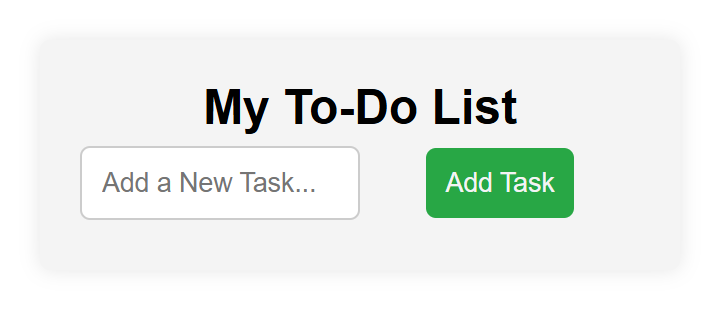

# Todo list project
#### Welcome to my website! This project is a simple web application built using HTML, CSS, and JavaScript. It showcases my skills in front-end development and serves as a portfolio piece.

# Live Demo

#### [View the live demo](https://my-todo-list-said.vercel.app)

# Table of Contents
### Features
### Technologies Used
### Usage
### Contributing
### License

# Features
#### Responsive Design: The website is designed to be mobile-friendly and looks great on all devices.
Interactive Elements: JavaScript is used to add interactivity, enhancing user experience.
Clean and Modern UI: The CSS styles provide a clean and modern look to the website.

# Technologies Used
HTML: For structuring the content of the website.
CSS: For styling and layout.
JavaScript: For adding interactivity and dynamic content.

# Usage
#### Feel free to explore the website and test its features. You can modify the code to customize the website according to your preferences.

# Contributing
#### Contributions are welcome! If you have suggestions for improvements or want to add new features, please fork the repository and submit a pull request.

# License
#### This project is licensed under the MIT License. See the LICENSE file for details.
